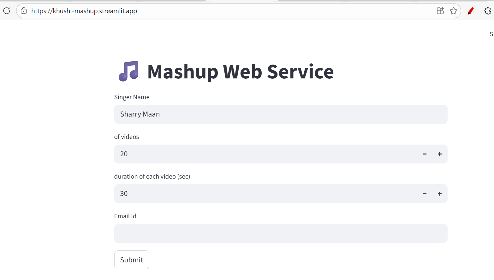

# **Title: YouTube Audio Mashup Generator**

## **1. Methodology**

The project is divided into two primary programs to fulfill the assignment requirements for **Predictive Analytics (TIET)**. The core engine is a command-line script that utilizes `yt-dlp` for high-fidelity audio extraction and `pydub` for precise audio manipulation. The workflow follows a sequential pipeline:

1. **Search & Retrieval**: Queries YouTube for the specified singer.
2. **Audio Processing**: Converts video streams to MP3 and trims the first  seconds of each track.
3. **Concatenation**: Merges all segments into a seamless single audio file.

## **2. Project Description**

This project serves as an automated tool for creating custom audio mashups.

* **Program 1 (`102303993.py`)**: A robust CLI tool for power users that supports automated downloading and merging based on strict parameters ( videos,  seconds).
* **Program 2 (`app.py`)**: A Streamlit-based web service that provides a graphical interface for the mashup engine, allowing users to input parameters and receive a processed ZIP file directly in their browser.

## **3. Input / Output**

The system requires four specific inputs to generate a unique output:

* **Inputs**: Singer Name (String), Number of Videos (Integer > 10), Duration per Video (Seconds > 20), and Email ID.
* **Output**: A processed `.mp3` mashup file bundled inside a `.zip` archive for optimized delivery.

## **4. Live Link**

**Link:** [[https://khushi-mashup.streamlit.app/](https://khushi-mashup.streamlit.app/)]

## **5. Screenshot of the Interface**
*
